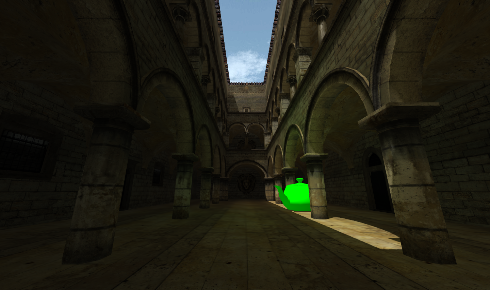

# Light-Propagation-Volumes

Part of a bachelor's thesis focused on real-time rendering of global illumination in browsers. This part is an implementation of Crytek's [Light Propagation Volumes](http://www.crytek.com/download/Light_Propagation_Volumes.pdf) using Javascript and WebGL.

### Thesis:
[Real-Time Global Illumination in Web-Browsers](http://publications.lib.chalmers.se/records/fulltext/256137/256137.pdf)
### Images:
  
